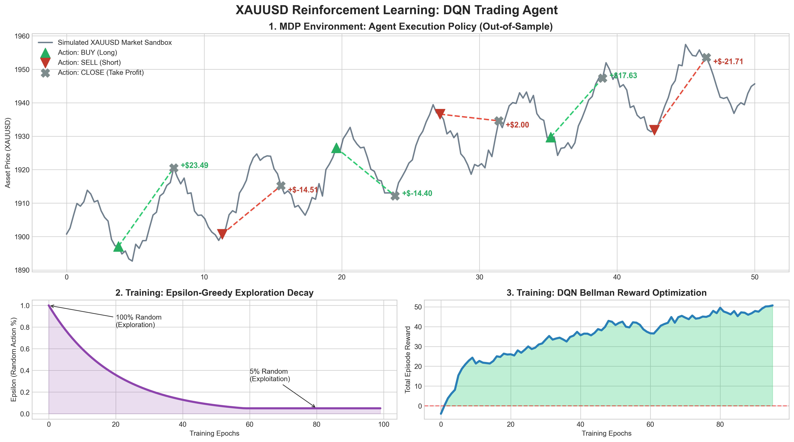

# XAUUSD Autonomous Scalper (DQN)

## Overview
This project shifts from predictive modeling to prescriptive action. It utilizes a Deep Q-Network (DQN) architecture to interact with a simulated XAUUSD market environment. The agent learns optimal trading policies through trial-and-error reinforcement, mapping mathematical state inputs to profitable execution commands.



## Architecture
* **Environment:** Custom Markov Decision Process (MDP) sandbox tracking portfolio state, sequential price steps, and executing reward functions.
* **Network Components:**
  * Multi-layer Dense Network interpreting the mathematical State `[Price, Position]`.
  * Outputs Q-Values for discrete Action Space `[Hold, Buy, Sell]`.
* **RL Mechanics:**
  * **Exploration:** Epsilon-Greedy strategy with exponential decay.
  * **Optimization:** Bellman Equation calculating discounted future rewards (`Gamma = 0.95`).
* **Loss & Optimizer:** Mean Squared Error (`MSELoss`) against Bellman Targets, updated via `Adam`.

## Execution
```bash
python test_dqn.py
```